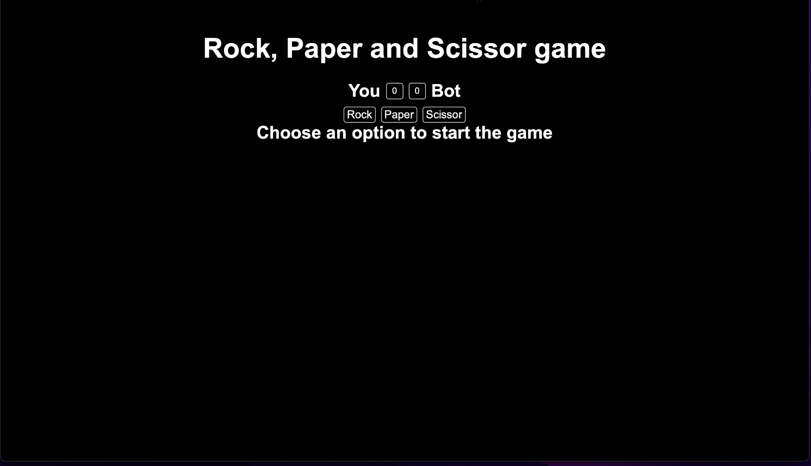

<h1 align="center">Rock Paper and Scissors Odin Project</h1>

This is a web project made with HTML, CSS and JavaScript for studying purposes

</img>

### Tools

The following tools have been used in the project:

- [HTML](https://html.com/)
- [CSS](https://developer.mozilla.org/pt-BR/docs/Web/CSS)
- [JavaScript](https://www.javascript.com)
- [VS Code](https://code.visualstudio.com)

---
### Project directions:
The following directions were used to create the project.

- [Odin Calculator Project](https://www.theodinproject.com/lessons/foundations-rock-paper-scissors)
---
### Author

Made by Felipe Augusto 

---

#### [Live Server](https://felipeabg.github.io/RockPaperScissor-ODIN/)

 
